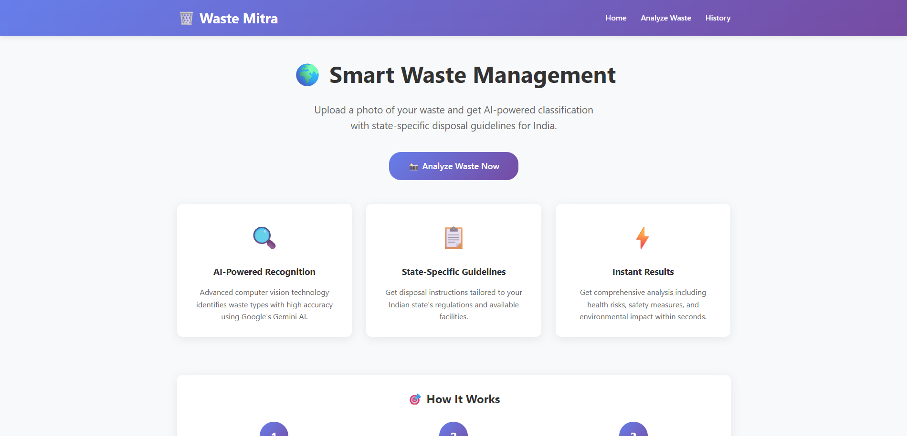
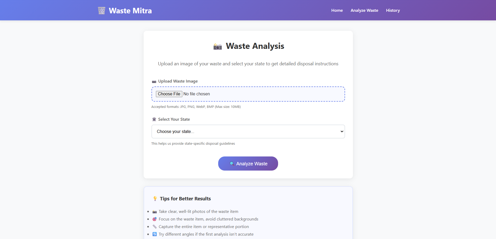
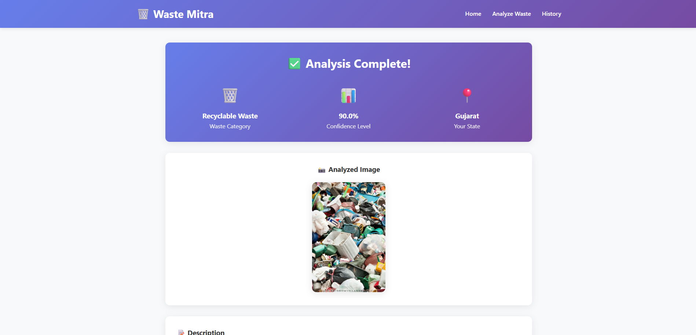

# Waste-Mitra

**Waste-Mitra** is a Django web application that empowers users to upload images of waste and receive intelligent, state-specific disposal guidance. It combines AI-powered image classification (via Gemini Vision or your chosen model) with Indian waste management regulations to provide actionable disposal instructions, hazard assessments, and safety recommendations.

---

## 🚀 Features

- **AI-Powered Classification**: Upload a photo of waste and receive instant classification into categories like medical, recyclables, e-waste, general, hazardous.
- **State-Specific Disposal Guidance**: Learn how to dispose of waste according to applicable Indian state laws (or default to national CPCB guidelines).
- **Hazard & Safety Info**: Understand environmental and health risks of improper disposal, and precautions to handle waste safely.
- **Classification History**: Track past uploads with image previews, category, confidence level, state, timestamp, and more.
- **Django Admin**: Manage disposal rules, waste categories, and user data easily via Django’s admin panel.

---

## 🛠 Tech Stack

| Component               | Details                                    |
|------------------------|---------------------------------------------|
| **Framework**          | Django                                       |
| **AI Model**           | Gem‑Vision / Gemini Vision / Custom CNN     |
| **Database**           | SQLite (for development; switchable to PostgreSQL or MySQL) |
| **Frontend**           | Django templates + Bootstrap (or TailwindCSS) |
| **Image Storage**      | Local `media/` folder; AWS S3 for production |
| **API (Optional)**     | Django REST Framework – JSON endpoints for waste analysis |
| **Deployment Options** | Heroku, Railway, PythonAnywhere, or AWS EC2 |

---

## 📂 Project Structure Overview

```
waste_mitra/
├── manage.py
├── waste_management/      # Django project settings
├── waste_classifier/      # Core app with models, views, forms
│   ├── templates/
│   │   ├── base.html
│   │   ├── home.html
│   │   ├── analyze.html
│   │   ├── results.html
│   │   ├── history.html
│   │   └── detail.html
│   └── static/
├── media/                 # Uploaded images storage
├── requirements.txt       # Project dependencies
└── db.sqlite3             # SQLite database (dev only)
```

---
## 📸 Screenshots

### 🏠 Home Page


### 🔍 Analyze Waste


### 📊 Results Page



---
## ⚙️ Setup & Installation

1. **Clone the Repo**  
   ```bash
   git clone https://github.com/vedang18200/-Waste-Mitra.git
   cd Waste-Mitra
   ```

2. **Create & Activate Virtual Environment**  
   ```bash
   python -m venv venv
   source venv/bin/activate   # macOS/Linux
   venv\Scripts\activate      # Windows
   ```

3. **Install Dependencies**  
   ```bash
   pip install -r requirements.txt
   ```

4. **Set Environment Variables**  
   Create a `.env` file (ensure `python-dotenv` is installed) to manage keys:
   ```
   SECRET_KEY=your_django_secret_key
   GEMINI_API_KEY=your_gemini_api_key
   ```

5. **Run Migrations**  
   ```bash
   python manage.py migrate
   ```

6. **Create a Superuser** (for admin access)  
   ```bash
   python manage.py createsuperuser
   ```

7. **Run the Dev Server**  
   ```bash
   python manage.py runserver
   ```
   Visit `http://127.0.0.1:8000/` and click **Analyze Waste Now** to test the image upload flow.

---

## 🔄 Usage Flow

1. **Analyze Waste**: Upload a waste image and select your state.
2. The backend calls the AI model to classify the waste.
3. The app retrieves disposal rules, hazards, and precautions from the database.
4. **Results** are displayed: waste type, confidence score, disposal method, risks, and safety tips.
5. **History** tab shows past submissions and results.

---

## 🔧 Customization & Extension

- **Add More States**: Update your Django model or JSON fixtures to include more Indian states.
- **Improve AI Accuracy**: Fine-tune Gemini prompts or train a custom model on a waste dataset.
- **Deploy with S3**: Use AWS S3 for media storage by configuring `django-storages`.
- **Internationalization**: Add multiple languages (e.g., Hindi, regional languages) using Django i18n.
- **User Accounts & Gamification**: Add user auth and reward users for proper disposal tracking.

---

## 🙌 Acknowledgements

- Powered by **Django**, **Gemini Vision API**, and guidelines from the **Central Pollution Control Board (CPCB)** and various **State Pollution Control Boards (SPCBs)**.
- Iconography from **Bootstrap Icons** and design inspired by the Swachh Bharat initiative.
